# deezer-mobile-clone

[](https://github.com/DanielKakona1/deezer-clone/actions/workflows/ci.yml)
[](https://github.com/DanielKakona1/deezer-clone/actions/workflows/e2e-mobile.yml)

Deezer-inspired mobile search + artist flow built as a `pnpm` Turborepo monorepo.

## Screenshots

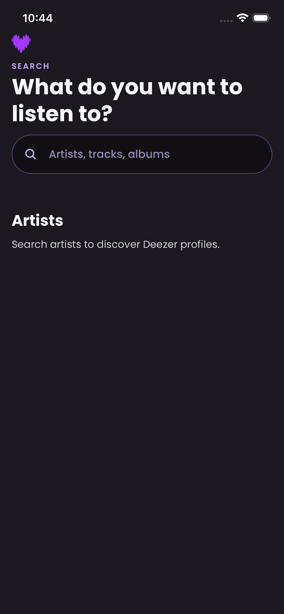
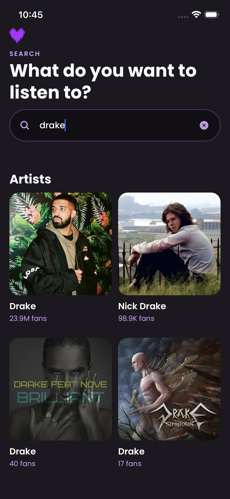
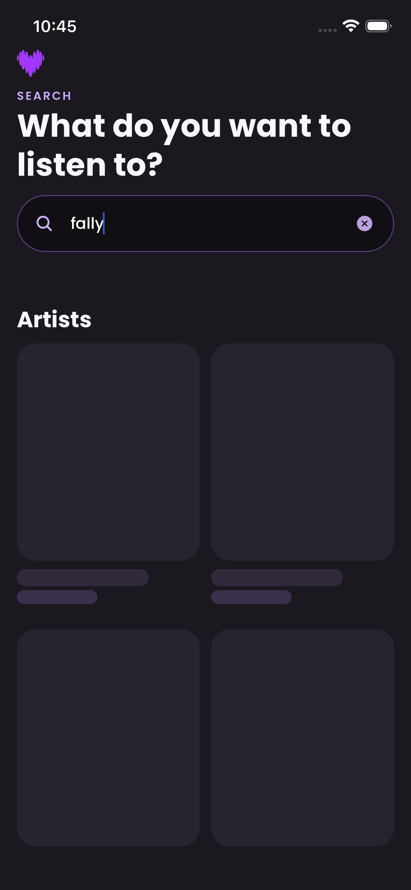
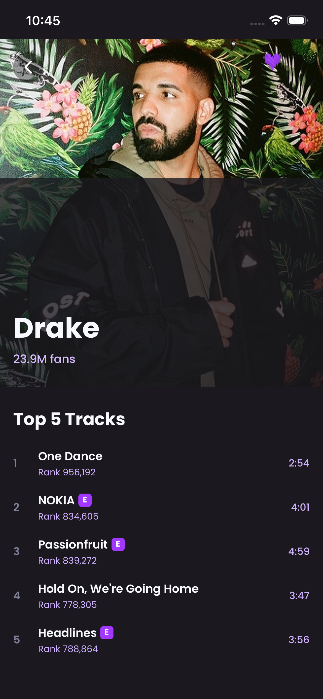
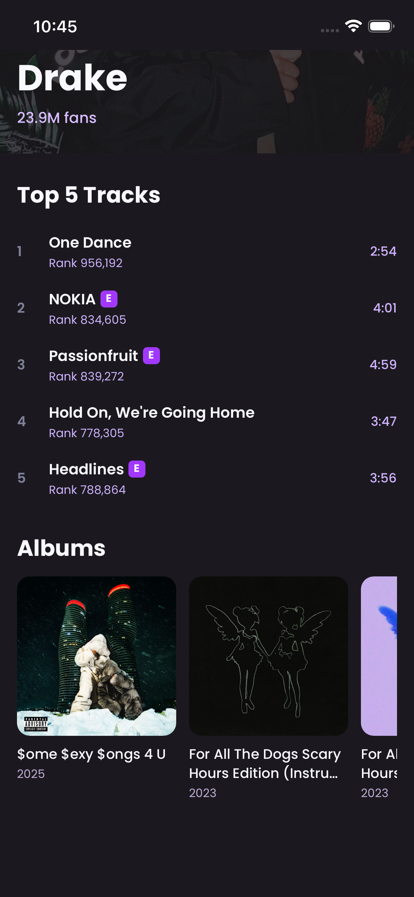
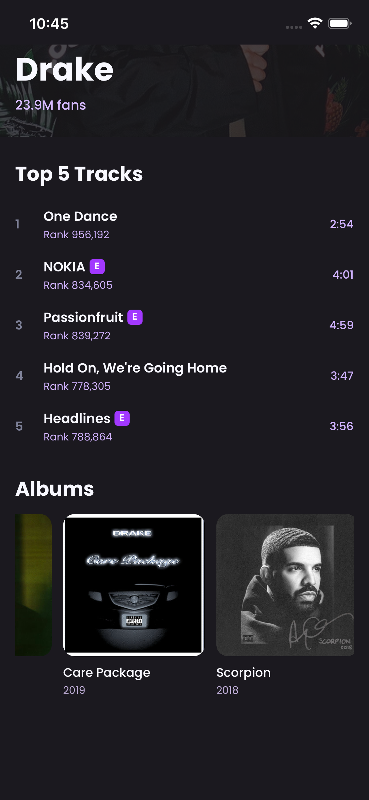
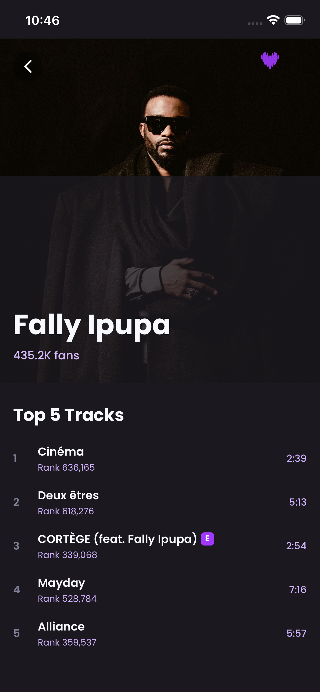
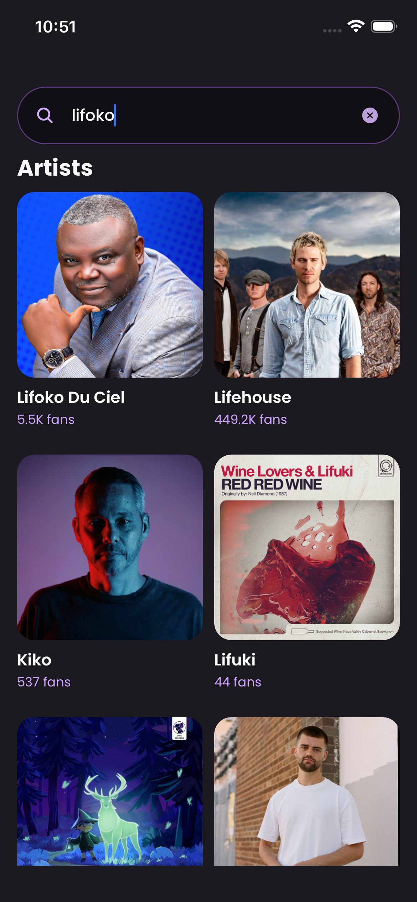
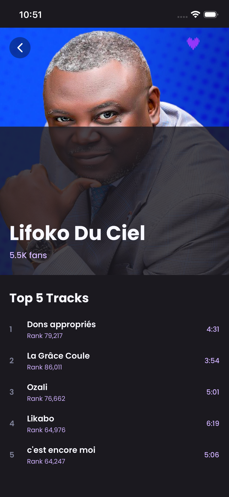
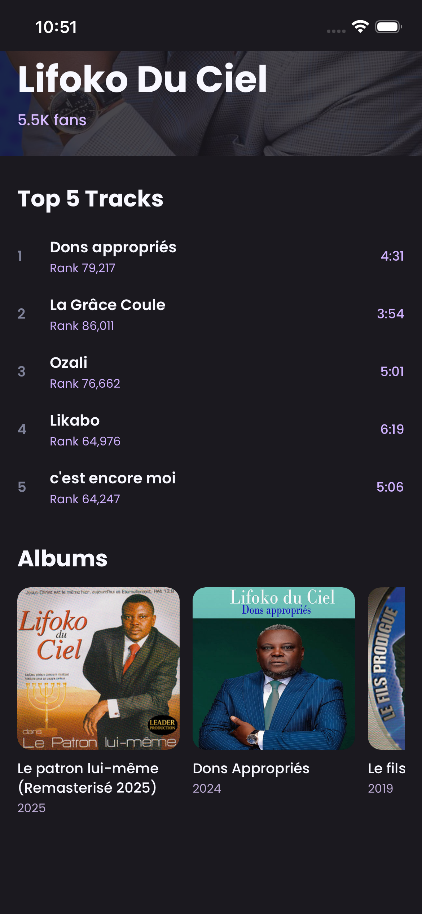
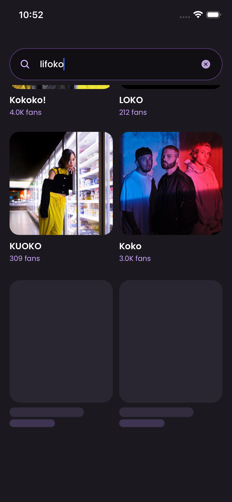

## Monorepo structure

- `apps/mobile` → Expo + React Native app
- `apps/backend` → Express + TypeScript + MongoDB cache API

## Prerequisites

- Node.js 20+
- `pnpm` 9+
- MongoDB (local or Atlas)
- Expo Go app (or iOS Simulator / Android Emulator)

## Environment variables

### Backend (`apps/backend/.env`)

```env
NODE_ENV=development
PORT=3333
DEEZER_API_BASE_URL=https://api.deezer.com
MONGODB_URI=mongodb://localhost:27017/deezer-mobile-clone
CORS_ORIGIN=*
RATE_LIMIT_WINDOW_MS=900000
RATE_LIMIT_MAX=200
```

`MONGODB_URI` points to your Mongo instance and defaults to `mongodb://localhost:27017/deezer-mobile-clone` if omitted.

### Mobile (`apps/mobile/.env`)

```env
# iOS simulator / local Expo
EXPO_PUBLIC_API_URL=http://localhost:3333/api

# Android emulator
# EXPO_PUBLIC_API_URL=http://10.0.2.2:3333/api

# Physical device (replace with your machine LAN IP)
# EXPO_PUBLIC_API_URL=http://192.168.1.42:3333/api
```

## Install dependencies

From repo root:

```bash
pnpm install
```

## Run in development

### 1) Start backend

```bash
pnpm --filter @deezer-mobile-clone/backend dev
```

### 2) Start mobile app

```bash
pnpm --filter @deezer-mobile-clone/mobile dev
```

Then use Expo shortcuts:

- Press `i` for iOS simulator
- Press `a` for Android emulator
- Scan QR with Expo Go on device

## API endpoints used

- `GET /api/deezer/search/artist?q=...&limit=...&index=...`
- `GET /api/deezer/artist/:artistId`
- `GET /api/deezer/artist/:artistId/top?limit=5`
- `GET /api/deezer/artist/:artistId/albums?limit=...&index=...`

## Caching behavior

- First identical artist-search query → fetches Deezer API and caches response
- Repeated same query/limit/index within 30 min → serves cached payload
- Cache older than 30 min → refreshes from Deezer and updates cache

## Run tests

### Backend unit/integration tests

```bash
pnpm --filter @deezer-mobile-clone/backend test:unit
pnpm --filter @deezer-mobile-clone/backend test:integration
```

Run all backend tests:

```bash
pnpm --filter @deezer-mobile-clone/backend test
```

### Mobile unit tests (Jest + RTL)

```bash
pnpm --filter @deezer-mobile-clone/mobile test:unit
pnpm --filter @deezer-mobile-clone/mobile test:integration
```

Run all mobile tests:

```bash
pnpm --filter @deezer-mobile-clone/mobile test
```

### Mobile E2E tests (Maestro)

Install Maestro CLI first (example macOS):

```bash
brew install maestro
```

Run flow:

```bash
pnpm --filter @deezer-mobile-clone/mobile test:e2e
```

Flow file:

- `apps/mobile/.maestro/search-artist-flow.yaml`

## EAS build

EAS config lives in:

- `apps/mobile/eas.json`

From `apps/mobile`:

### Development build

```bash
eas build --profile development --platform ios
eas build --profile development --platform android
```

### Preview build

```bash
eas build --profile preview --platform ios
eas build --profile preview --platform android
```

### Production build

```bash
eas build --profile production --platform ios
eas build --profile production --platform android
```

## Platform notes

- iOS local dev: Xcode + iOS Simulator installed
- Android local dev: Android Studio + emulator configured
- For physical devices, ensure backend URL in `EXPO_PUBLIC_API_URL` is reachable from the phone network
